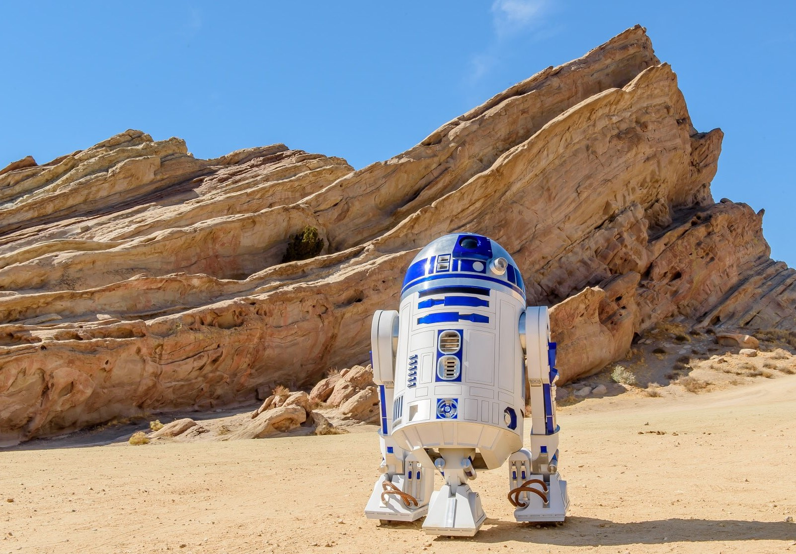
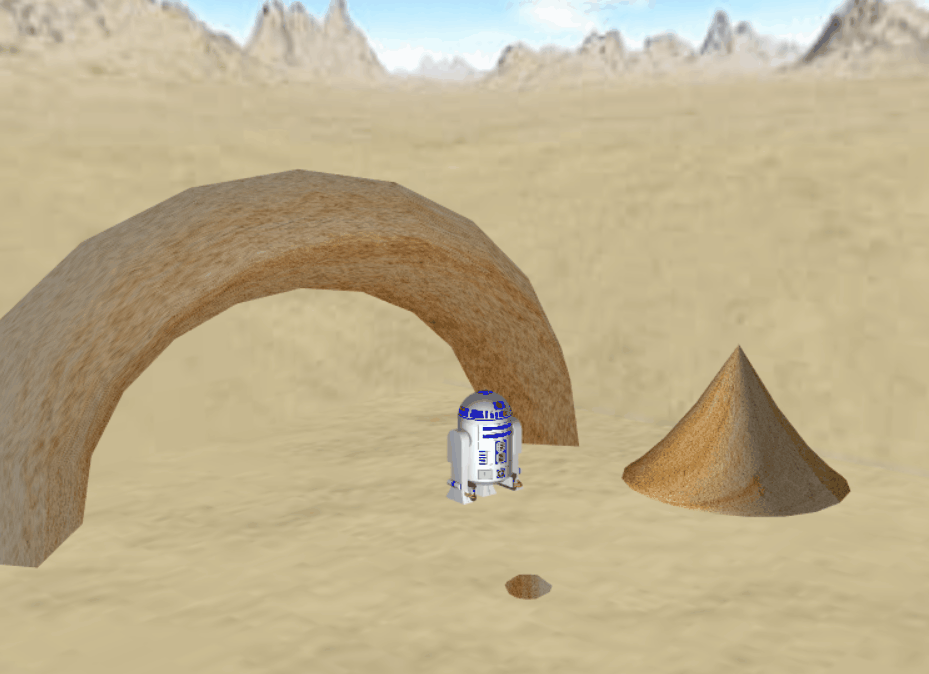

# LAIG 2020/2021 - TP2

## Group T03G04

| Name            | Number    | E-Mail               |
|-----------------|-----------|----------------------|
| Eduardo Correia | 201806433 | up201806433@fe.up.pt |
| Telmo Baptista  | 201806554 | up201806554@fe.up.pt |

----

## Project information

- All of the specified primitives were done and support any kind of texture, material, transformation, animation and 
instantiation. 
- Our parser handles all kinds of errors that may occur, giving warnings and assuming default values for missing components and is organized into multiple parts.

### Scene
- Our [scene](scenes/LAIG_TP1_XML_T3_04.xml) consists in a representation of Star Wars IV's part in which the character R2-D2 is stranded in the desert planet of Tatooine.
- More precisely, it represents a section of the movie that didn't make it to the final cut where the robot walks into a rock, triping over it and subconsequently damaging its internal circuits (poor R2-D2).
- As R2-D2 is already a complex structure, extreme details are hard to implement here due to limitations on the primitives, so the R2-D2 represented is simplified to give the main charm of the robot, insteadd of the full package.

----

## Issues/Problems

- There wasn't any problem detected while testing with other groups XML's.

